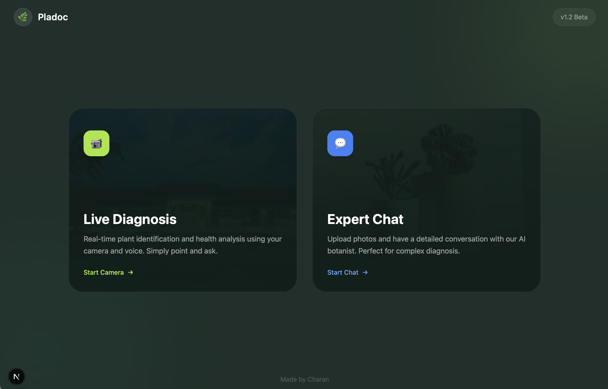
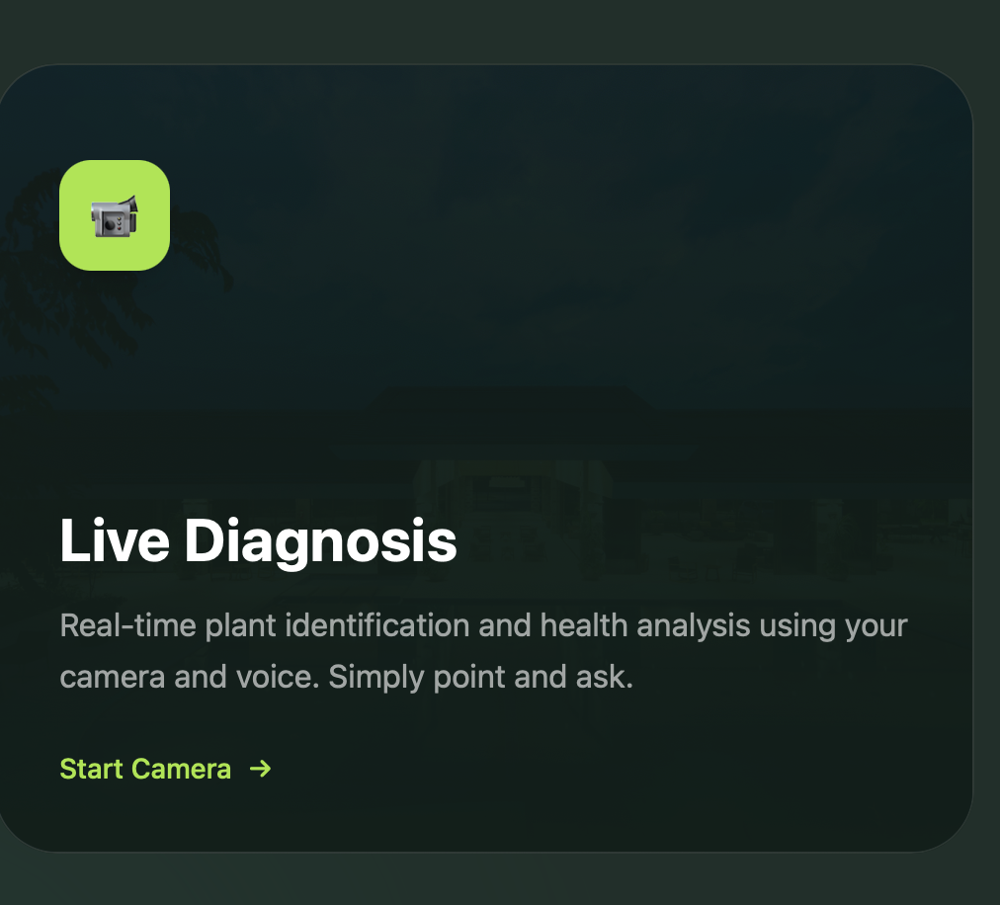
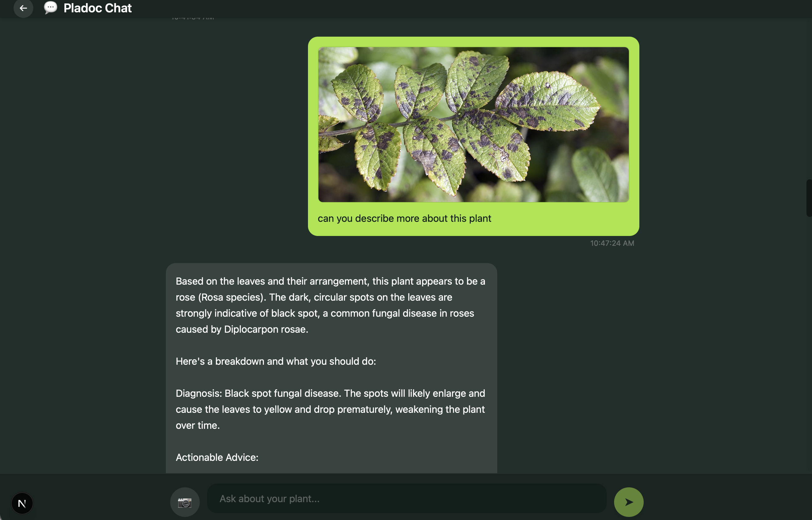

# 🌿 Pladoc: The AI Plant Doctor

**Pladoc** (formerly Plant Pilot) is a professional grade, multimodal AI application designed for real-time plant diagnosis and botanical consultation. It combines low-latency voice/video interaction with a persistent expert chat interface.

---

###  Key Features

- **Pladoc Live**: A real-time mode using the **Gemini 2.0 Flash Multimodal Live API**. Point your camera and ask questions via voice—the AI "sees" your plant and talks back instantly.
  
  

- **Pladoc Chat**: A dedicated expert consultation page where you can upload photos, maintain long-term chat history, and receive persistent care advice.

  

- **Conversation Memory**: The AI remembers previous interactions, allowing for seamless follow-up questions like *"Can you suggest similar plants?"*
- **Visual Logic**: Integrated "Plant Pathologist" system prompt for expert-level diagnostic accuracy.

---

###  The Intelligence Layer

####  The Model
- **Primary Model**: `gemini-2.0-flash`
- **Why Gemini?**: It is currently the industry leader for high-performance, low-latency multimodal reasoning. Its unique "Live API" allows us to pipe video frames and audio streams directly over WebSockets for a truly "human-like" conversation.

####  LLM Provider Logic
- **Failover Routing**: We implement a provider-agnostic layer (`LLMProvider`) that attempts to use Gemini first (for vision/voice) and can fall back to **Groq**, **Together**, or **Hugging Face** for text-only queries if needed.

---

###  Backend Core Architecture

- **Framework**: **FastAPI** (Python 3.12)
  - Chosen for its high-performance asynchronous support, critical for handling multiple WebSocket connections and concurrent database queries.
- **Primary Database**: **PostgreSQL (Neon)**
  - Stores relational data: User sessions, Chat history, and message metadata.
- **Knowledge Base**: **Neo4j (Graph Database)**
  - Stores complex botanical relationships, plant species, and care guidelines.
- **Media Serving**: Built-in Static File serving for uploaded plant photos, ensuring the frontend has direct access to high-resolution diagnostic images.

---

### 🖥️ Frontend Stack

- **Framework**: **Next.js 14** (App Router)
- **Styling**: **Vanilla CSS + Tailwind UT** for a premium, dark-mode focused aesthetic (Glassmorphism).
- **Audio/Video**: Native `MediaDevices` API for capturing low-latency streams for the Gemini Live integration.

---

###  Local Setup

**Backend:**
1. Navigate to `/backend`
2. Configure `.env` with your `GOOGLE_API_KEY` and database credentials.
3. `uvicorn app.main:app --reload --port 8000`

**Frontend:**
1. Navigate to `/frontend`
2. `npm install`
3. `npm run dev`

---

###  Evolution: Why this architecture?
We chose a **Hybrid WebSocket/REST** architecture to solve two different user needs:
1. **Live mode** requires sub-second latency, handled by WebSockets directly to the Gemini Live API.
2. **Chat mode** requires persistence and reliability, handled by standard REST endpoints and PostgreSQL for robust session management.

*Made by Charan*
